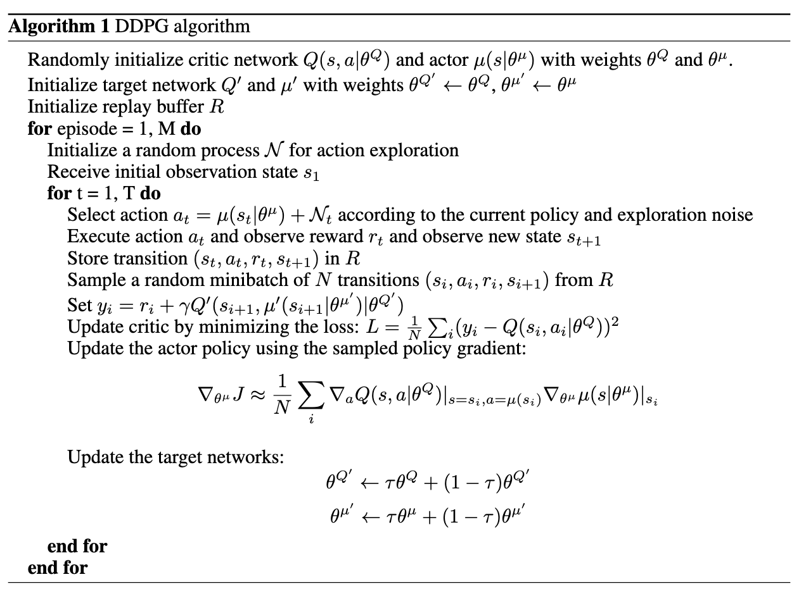

# Reacher - Continuous Control

This notebook contains the solution of the second project of the [Deep Reinforcement Learning Nanodegree](https://www.udacity.com/course/deep-reinforcement-learning-nanodegree--nd893).

## The Environment

It uses the Reacher environment from [Unity Technologies](https://github.com/Unity-Technologies/ml-agents/blob/master/docs/Learning-Environment-Examples.md#reacher) environment.


In this environment, a double-jointed arm can move to target locations. A reward of `+0.1` is provided for each step that the agent's hand is in the goal location.  
Thus, the goal of the agent is to maintain its position at the target location for as many time steps as possible.

The task is episodic, and in order to solve the environment, the agent must get an average score of `+30` over `100` consecutive episodes.

Please note, that the files `ddpg_agent.py` as well as `model.py` are needed.
The first version of the task is implemented where a single agent is interacting with the environment.

### State and Action Spaces

The observation space consists of 33 variables corresponding to position, rotation, velocity, and angular velocities of the arm.  
Each action is a vector with four numbers, corresponding to torque applicable to two joints. Every entry in the action vector should be a number between `-1` and `1`.

## DDPG - Agent

[Deep Deterministic Policy Gradient](https://arxiv.org/pdf/1509.02971.pdf) is a Actor-Critic based algorithm.  
It is model-free and has a off-policy approach.
It is combining approaches from `DQN` (see the previous project) and `DPG`, extending `DQN`'s discrete space ability to also work in continuous space, applying a deterministic policy.

The Actor and Critic are represented by two neural networks.  
Former approximates the optimal policy in an argmax Q(s, a) fashion without learning the probability distribution of the actions first, unlike the pure value-based approaches.
The latter uses the actions provided by the actor to approximate the optimal action-value for each state.

### Visualization


### Pseudocode



### Integrated Extensions

#### Replay Buffer

A replay buffer is a stack of (s1, a1, r1, s2) experiences.  
DDPG, being a off-policy approach - the action policy is not the policy which is improved, it is possible to increase the sample-efficiency by storing past transitions.  
These past transitions are being sampled resulting in a uncorrelated relationship to the originally obtained experience sequence. This also ensures the general assumption that samples are independently and identically distributed.

#### Target Updates

In order to have a stable evaluation, being not dependent on current instabil improvement steps, two neural networks are deployed for each, actor and critic.
The target networks weights are much slower updated, resulting in a more stable evaluation.

#### Exploration Noise

In order to deploy exploration in continuous action space the Ornstein-Uhlenbeck noise is being applied.

### Implemention

The environment is based on [Unity ML Agent's Reacher](https://github.com/Unity-Technologies/ml-agents/blob/main/docs/Learning-Environment-Examples.md) and was modified by Udacity.

The [Reacher.ipynb](Reacher.ipynb) uses the headless environment and the [DDPG Agent](ddpg_agent.py), which in turn is depending on the [model.py](model.py).

Notable external dependencies is the [PyTorch libary](https://pytorch.org/).


The convergence plot shows that the agent achieves a target score of 30 consistently after around 240 episodes.

Notable parameters are:

```python

# DDPG training
n_episodes=1000         # number of episodes to train
max_t=1000              # max steps per trajectory
score_target=31         # if the avg score of the last 100 episodes is above this threshold, terminate
print_every=10         # log episode and avg. score every x episodes

# DDPG agent
BUFFER_SIZE = int(1e6)  # replay buffer size
BATCH_SIZE = 128        # minibatch size
GAMMA = 0.99            # discount factor
TAU = 1e-3              # for soft update of target parameters
LR_ACTOR = 1e-4         # learning rate of the actor
LR_CRITIC = 1e-4        # learning rate of the critic
WEIGHT_DECAY = 1e-4     # L2 weight decay

# Models
# Actor
fc1_units=128           # number of neutrons in feed forward layer
fc2_units=128           # number of neutrons in feed forward layer
# Critic
fc1_units=128           # number of neutrons in feed forward layer
fc2_units=128           # number of neutrons in feed forward layer
```

So the network architecture has 2 layers with 128 nodes.

A [ReLU](<https://en.wikipedia.org/wiki/Rectifier_(neural_networks)>) activation functions for both layers.  
And a Batch normalization function between the first and second layer.

Those architectures are deployed with a local and target network for both, actor and critic - please refer to [ddpg_agent.py](ddpg_agent.py) and [model.py](model.py) for the specific implemenation.

### Future work

Implementing 20 agents as multi-agent task.
